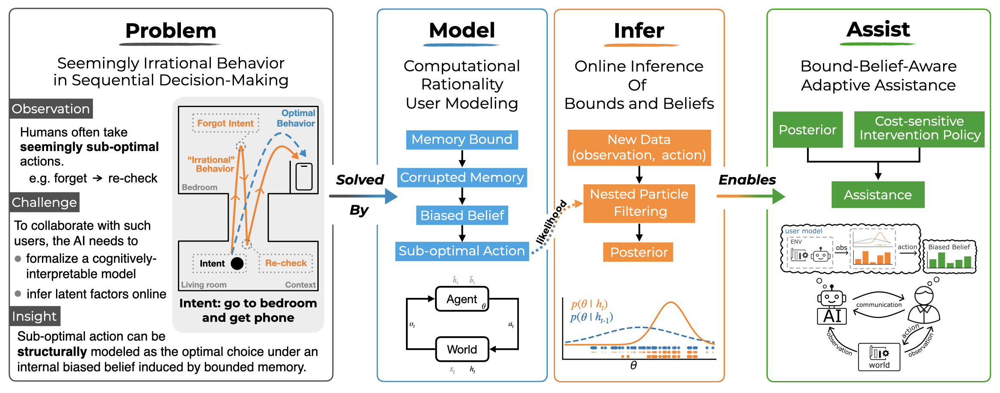
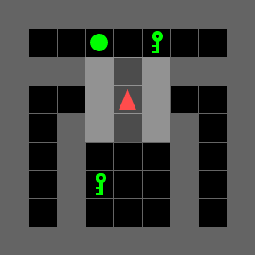

# More Than Irrational: Modeling Belief-Biased Agents

[](https://arxiv.org/abs/2511.12359)
[](https://ojs.aaai.org/index.php/AAAI/article/view/40242)
[](https://yifan-zhu.github.io/AAAI26-Belief-Biased-Agents-Website/)

Code for the AAAI 2026 paper *More Than Irrational: Modeling Belief-Biased Agents*. For materials such as video, slides, poster, please check out our [project website](https://yifan-zhu.github.io/AAAI26-Belief-Biased-Agents-Website/), or [underline](https://underline.io/lecture/143120-more-than-irrational-modeling-belief-biased-agents). 

A user that looks irrational can still be acting optimally, just on the wrong belief. We model this directly: a bounded memory keeps forgetting parts of what the user has seen, so the belief it plans against no longer matches the world, and its otherwise-optimal choices come out sub-optimal. On top of that user model we run an online filter that watches a stream of actions and recovers both the hidden belief and the scalar memory bound $\theta$. An assistant then uses the inferred $\theta$ to decide when and how to help.




## Overview

The design keeps two things apart: what the user *believes* and what the user *does*. The user always plans optimally for its current belief. All of the apparent irrationality comes from one memory process that corrupts that belief, which turns the bias into a single quantity $\theta$ we can infer online.

<p align="center">
  
</p>

- **Environment** (`crci_mem/envs`). A classic RL exploration (navigation) task *heaven or hell* (`MemoryDecayExp_9x9-v0`), created with [MiniGrid](https://minigrid.farama.org/content/create_env_tutorial/): the agent has to reach a goal that depends on a target it saw earlier in the episode.
`MemoryDecayMDP_9x9-v0` is the fully observed version, used to train the optimal reference policy.
- **User model** (`crci_mem/user_model`). `ForgetfulHH`, a PPO policy that acts on a belief rather than the raw state. Two memory models are provided, selected by `user_model.memory.model`:
  - **resample-fresh (default, model A)**, where every retained target observation is independently dropped with probability $\theta$ each step and the belief is recomputed from whatever survives (a forgotten target can come back, so the belief is dynamically inconsistent); 
  - **persistent (model B)**, where a dropped target stays dropped until re-observed. 
- **Inference** (`crci_mem/inference`). A nested particle filter that runs online across multiple episodes with one singer user (streaming, up to 100 steps). Outer particles carry $\theta$, inner particles carry the belief.
- **Assistant** (`crci_mem/envs/assistant_env.py`). An assistive-POMDP whose hidden state includes the user's $\theta$. The assistant obtains $p(\theta \mid \{\tau\})$ by the filter and chooses one of {`do nothing`, `action hint`, `memory hint`}, maximizing user reward minus the cost of the hint.

## Setup

```bash
conda env create -f environment.yml
conda activate crci-mem
pip install -e .
```

## Reproducing the paper
Order: train user policies → behaviour → inference → train assistant policy → assistance. 

### 1. Train the user policies (Fig 2)

```bash
# per-θ ForgetfulHH policies (Model A → models/user_models/<env>/modelA/). Each policy keeps its top-N eval checkpoints (training.num_best_models) + ppo_<theta>_best.zip. Trains the list sequentially; under a SLURM array (--array=0-10) each task trains one θ, in parallel.
python scripts/user_model/train.py 'user_model.memory.thetas=[0.0,0.1,0.2,0.3,0.4,0.5,0.6,0.7,0.8,0.9,1.0]'

# MDP optimal policy (the assistant's action-hint oracle; fully observed, no belief wrapper). 
python scripts/user_model/train.py env.name=MemoryDecayMDP_9x9-v0 env.use_belief=false training.timesteps=400000

# re-evaluate every top-N candidate, keep the best per θ, render behaviour trajectories (Fig 2).
# Defaults to --model A and the runs/default paths.
python scripts/user_model/evaluate_and_select.py --gif
```

The Model B (persistent) policies are trained by a warm-start curriculum seeded from the modelA θ=0.0
policy:

```bash
python scripts/user_model/curriculum_train.py \
    --init-policy runs/default/models/user_models/MemoryDecayExp_9x9-v0/modelA/ppo_0.0_best.zip \
    --thetas 0.1,0.2,0.3,0.4,0.5,0.6,0.7,0.8,0.9,1.0
```

### 2. Inference (online θ recovery, Fig 3–4)

```bash
# 11 θ × 5 seeds, streaming nested PF (reads modelA). Runs all 55 sequentially here; on a cluster launch as a SLURM array (each task reads $SLURM_ARRAY_TASK_ID).
python scripts/inference/run_inference.py
# aggregate over θ×seeds to get the error-vs-step curve (Fig 3) + per-θ posterior-vs-step panels (Fig 4)
python scripts/inference/evaluate_inference.py --trajectories
```

### 3. Train and evaluate the assistant (Fig 5–6)
The assistant runs the user under Model B (`agent.memory_model=B`.

```bash
python scripts/ai_assistant/train.py
python scripts/ai_assistant/evaluate.py evaluation.mode=both
```

### Notes
This release reproduces the paper's pipeline but further improves training stability; the paper's conclusions are unchanged.

- **User policies (Model A).** The paper trains each $\theta$ from scratch (cold start) and selects the best across several random seeds. While preparing this release we found cold training unstable at mid/high $\theta$: some seeds collapse to a near-random policy (local optimum), so we added a **warm-start curriculum** (`curriculum_train.py --model A`) that anneals $\theta$ up from the $\theta$=0.0 policy. It trains stably and gives policies closer to the per-$\theta$ belief-optimal. **Online $\theta$ inference is unaffected**, which still recovers $\theta$ to under 0.01 posterior error.
- **Assistant.** The paper's assistant was trained on the cold-start Model A user (policies *and* wrapper). This release adds a new setting, warm-start policies and the persistent **Model B** belief. 


## Compute

Everything trains from scratch on a single GPU on cluster. Measured wall-clock on **1x NVIDIA H200** for user policy training and inference, and **1x NVIDIA V100** for assistant policy training and evaluation.

| Stage | Scale | Wall-clock|
|---|---|---|
| User policies, Model A, per $\theta$ | 800k steps | ~68 min (the 11 θ run in parallel as a SLURM array) |
| Curriculum, Model B (10 $\theta$) | 10 × 400k steps | ~6.1 h (sequential warm-start; Model A warm-start is comparable) |
| MDP oracle | 400k steps | ~9 min |
| Behaviour eval + trajectory figures | — | ~4 min |
| Inference, per experiment | 1 $\theta$ × 1 seed | ~0.5–1 min (the 55 experiments run in parallel as a SLURM array) |
| Inference aggregation + figures | 11 $\theta$ × 5 seeds | ~2 min |
| Assistant (train, with the particle filter in the loop) | 5M steps | ~32h |


## Citation
If you use this codebase or find our work useful in any way, please cite our work :)
```bibtex
@inproceedings{zhu2026more,
  title     = {More Than Irrational: Modeling Belief-Biased Agents},
  author    = {Zhu, Yifan and Katt, Sammie and Kaski, Samuel},
  booktitle = {Proceedings of the AAAI Conference on Artificial Intelligence},
  year      = {2026}
}
```

## Acknowledgements
This work was supported by the Research Council of Finland (Flagship programme: Finnish Center for Artificial Intelligence FCAI, Grant 359207), ELISE Networks of Excellence Centres (EU Horizon:2020 grant agreement 951847), and UKRI Turing AI World-Leading Researcher Fellowship (EP/W002973/1). 

We acknowledge the research environment provided by [ELLIS Institute Finland](https://www.ellisinstitute.fi/). We also acknowledge the computational resources provided by the [Aalto Science-IT Project from Computer Science IT](https://scicomp.aalto.fi/triton/) and [CSC–IT Center for Science](https://csc.fi/en/), Finland.
